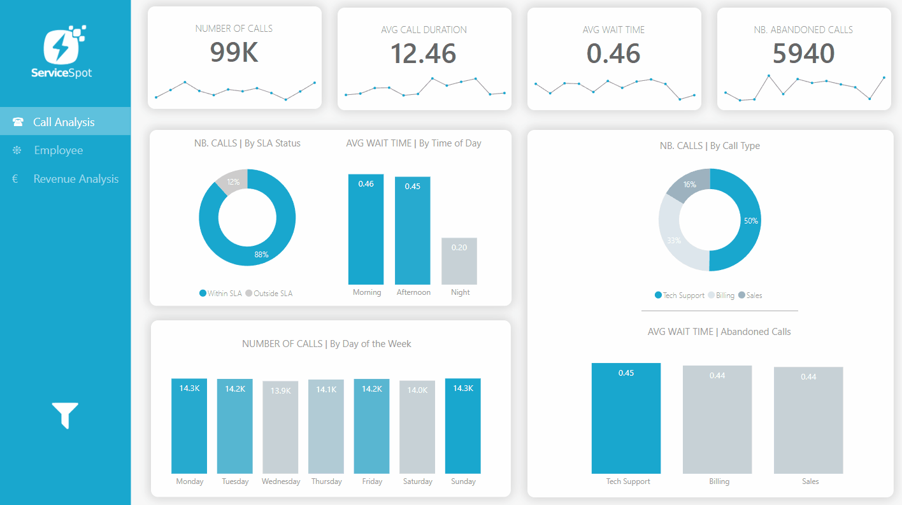
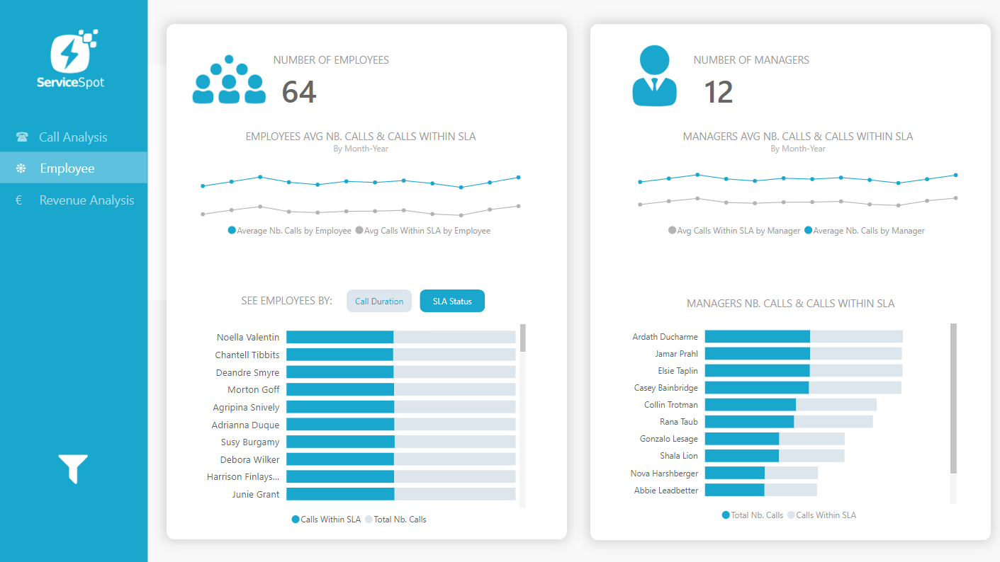
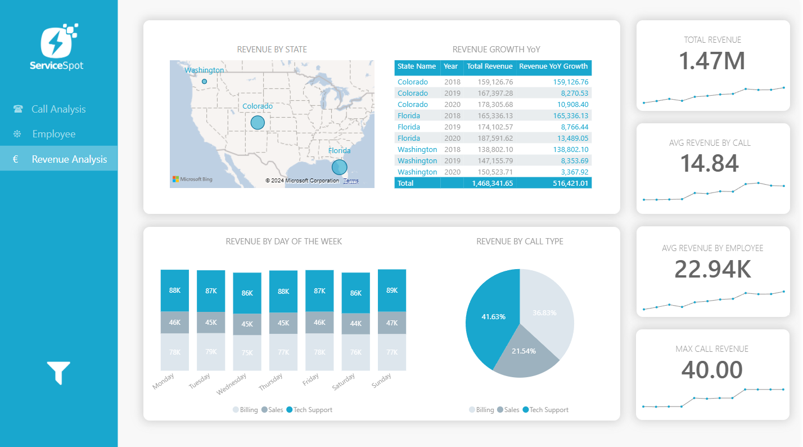
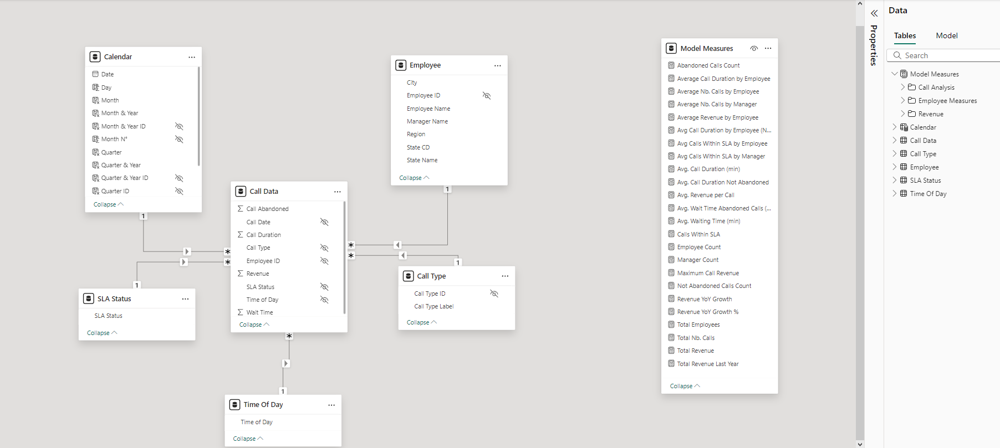

# Dashboard Power BI : Performance des Appels et Analyse Financière de Service Spot

### **Introduction :**
Le projet consiste en la création d'un tableau de bord Power BI interactif et dynamique pour l'analyse de la performance des appels, la gestion des équipes et le suivi des revenus de l'entreprise. Ce tableau de bord s'adresse principalement aux managers et aux équipes de direction, afin de leur fournir une vue d'ensemble claire et précise sur les opérations quotidiennes de support client, ainsi que sur l'impact financier de ces activités. Grâce à une interface intuitive, il permet aux utilisateurs d'explorer les données sous différents angles, facilitant ainsi la prise de décision basée sur des insights data-driven.

### **Objectifs du Projet :**
1. **Optimiser le suivi des performances des appels :** 
   - Mesurer et analyser les volumes d'appels, les durées de traitement, les temps d'attente, et le respect des délais SLA (Service Level Agreement).
   - Identifier les périodes et les types d’appels qui nécessitent le plus d'attention pour optimiser la gestion des ressources et améliorer la qualité du service client.

2. **Analyser la performance des employés et des managers :**
   - Évaluer la contribution de chaque employé et manager à la gestion des appels, en tenant compte des performances individuelles et du respect des SLA.
   - Identifier les points forts et les opportunités d'amélioration au sein des équipes pour optimiser les processus de travail.

3. **Suivre et maximiser les revenus générés par les appels :**
   - Analyser les revenus générés par les différents types d'appels (facturation, ventes, support technique).
   - Comprendre la répartition géographique des revenus et suivre la croissance des revenus dans les différents États, afin de soutenir le développement stratégique de l'entreprise.

4. **Faciliter la prise de décision grâce à une visualisation claire et interactive :**
   - Offrir un tableau de bord ergonomique avec des fonctionnalités avancées telles que les bookmarks, les filtres interactifs et les drill-throughs pour explorer les données en profondeur.
   - Permettre aux utilisateurs de naviguer facilement entre les différents aspects de l’analyse, et d’obtenir des réponses rapides à leurs questions pour une meilleure réactivité dans la gestion de l’entreprise.

Pour présenter ce projet Power BI dans votre portfolio de data analyst, il est important de décrire sa structure, les questions posées par chaque visualisation, ainsi que les techniques utilisées pour une navigation efficace. Voici une description qui peut être utile pour cela :

### 1. **Organisation Générale du Tableau de Bord**
   - **Thèmes de l’analyse** : Le tableau de bord est structuré autour de trois thèmes principaux :
     - **Analyse des appels** : Suivi des performances des appels (quantité, durée, temps d’attente, respect des SLA).
     - **Analyse des employés et des managers** : Performance des équipes dans la gestion des appels.
     - **Analyse des revenus** : Visualisation des revenus générés par les appels, avec des détails par type d'appel et par région.
   - **Structure des Pages** : Chaque thème dispose de sa propre page ou onglet, permettant de se concentrer sur des aspects spécifiques des données. Les utilisateurs peuvent naviguer entre les pages pour passer de l’analyse des appels à celle des performances des équipes, puis aux aspects financiers.

### 2. **Questions Posées par Chaque Page**
   - **Analyse des Appels** :
     - **Nombre d'appels par type** : Quels sont les types d'appels les plus fréquents (technique, facturation, ventes) ?
     - **Temps d'attente moyen** : Quel est le temps d'attente moyen pour chaque type d'appel et comment varie-t-il selon les moments de la journée ?
     - **Analyse SLA** : Quelle proportion d'appels respecte les délais SLA ? Quels sont les types d'appels qui sortent le plus des délais SLA ?
     - **Appels abandonnés** : Quelle est la répartition des appels abandonnés par type ? Quel est leur impact sur le service ?
     

   - **Analyse des Performances des Employés et Managers** :
     - **Volume d'appels gérés par chaque employé** : Quel est le nombre moyen d'appels traités par employé ? Quelle est la proportion d'appels dans le respect des SLA pour chaque employé ?
     - **Comparaison des managers** : Quels managers ont les équipes les plus performantes en termes de volume d'appels et de respect des SLA ?
     - **Suivi temporel** : Comment les performances des employés et managers évoluent-elles au fil du temps (par mois ou année) ?
     

   - **Analyse des Revenus** :
     - **Revenus par type d'appel** : Quel type d'appel génère le plus de revenus (facturation, ventes, support technique) ?
     - **Revenus par région** : Comment les revenus se répartissent-ils entre les différents États (Floride, Colorado, Washington) ?
     - **Croissance des revenus** : Quelle est l’évolution des revenus année par année par État ?
     

### 3. **Modélisation des Données**
   Le tableau de bord repose sur une modélisation de données, qui facilite l'analyse des appels, des performances des employés et des revenus. Le modèle de données intègre plusieurs tables interconnectées, chacune jouant un rôle spécifique pour enrichir l'analyse :

   - **Call Data** : La table principale contenant les informations sur chaque appel, y compris la durée, l'heure de l'appel, et les détails des appels abandonnés.
   - **Sources Calendar** : Table de calendrier pour effectuer des analyses temporelles (par jour, mois, année) et observer les variations au fil du temps.
   - **Employee** : Détails sur les employés impliqués dans la gestion des appels, permettant d'évaluer les performances individuelles.
   - **Call Type** : Catégorisation des appels (support technique, facturation, ventes) pour comprendre la répartition des appels par type.
   - **Time of Day** : Définition des périodes de la journée (matin, après-midi, nuit) afin de mieux analyser les pics d'activité et les temps d'attente.
   - **SLA Status** : Indicateur de la conformité des appels aux délais SLA, essentiel pour évaluer la qualité du service.

   L'image ci-dessous présente le modèle de données utilisé pour ce projet, illustrant les relations entre les différentes tables et la manière dont elles interagissent pour permettre une analyse approfondie :

   
